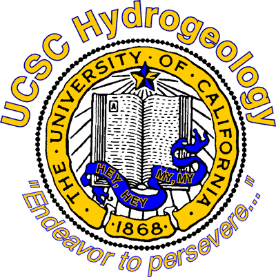

Currently, I am studying marine hydrothermal systems in <a href="https://websites.pmc.ucsc.edu/~afisher/"> Dr. Andrew Fisher's Hydrogeology Lab</a> at the University of California, Santa Cruz. Being that it is early on in the process of my doctoral studies I have a wide birth of topics I am interested in which include but are not limited to:
- Numerical modeling of hydrothermal processes on mid ocean ridge hydrothermal systems
- 2D and 3D modeling of North Pond on the western flank of the Mid-Atlantic ridge.
- Hydrothermal/geothermal characterization of Enceladus
- Carbon sequestration techniques

Please see my latest blog posts on research developments and more insight in to the marine hydrogeology side of the Fisher Lab!

