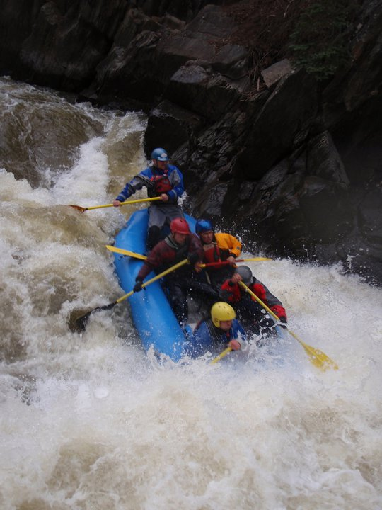
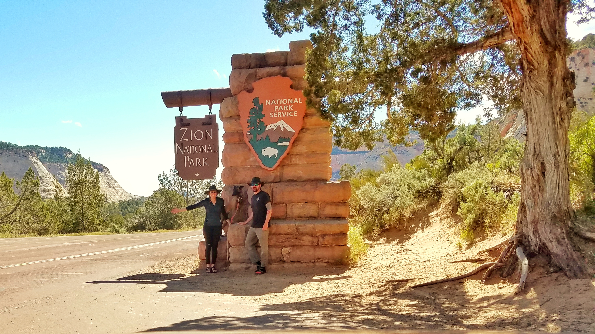
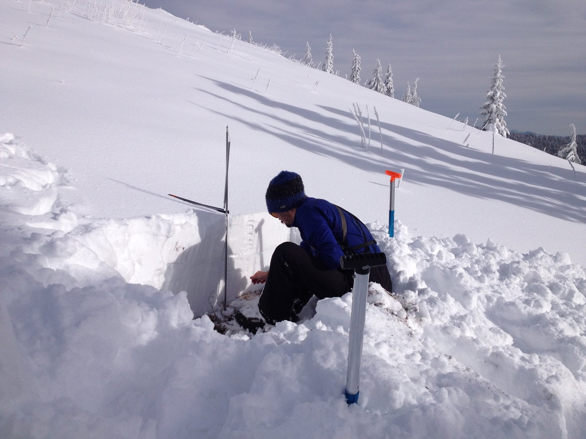

<h3> I spent the majority of my childhood in a small town in the
San Juan Mountains of Southern Colorado. During my upbringing and time there,
I enjoyed many outdoor pursuits and still do to this day. I am a professionally
licensed river guide and guide instructor in the State of Colorado with well over 500
trips and 8000 river miles guided. Additionally, I enjoy skiing, hiking, and
mountain biking. My outdoor pursuits undoubtedly contributed to my intrinsic curiosity
about the natural world, which therein sparked a journey of academic discovery
leading to my current position as a Ph.D. student. </h3>

<figure>
  
  <figcaption>Guiding the "Eye of the Needle" on the Piedra River, Colorado</figcaption>
</figure>

<h3>After my a redirection from outdoor guiding and time on a wildland hotshot crew,
 I restarted my academic career at Colorado State University before transferring
 and ultimately earning a degree from the University of Idaho.
 During my free time I enjoy spending time with my fiance Danielle and dog Jupiter,
participating in many of the activities listed above.</h3>

<figure>
  
  <figcaption>Adam, Danielle, and Jupiter at Zion NP!</figcaption>
</figure>

<figure>
  
  <figcaption>Adam taking some early season snow pit measurements on Freeze Out Ridge, Idaho</figcaption>
</figure>
