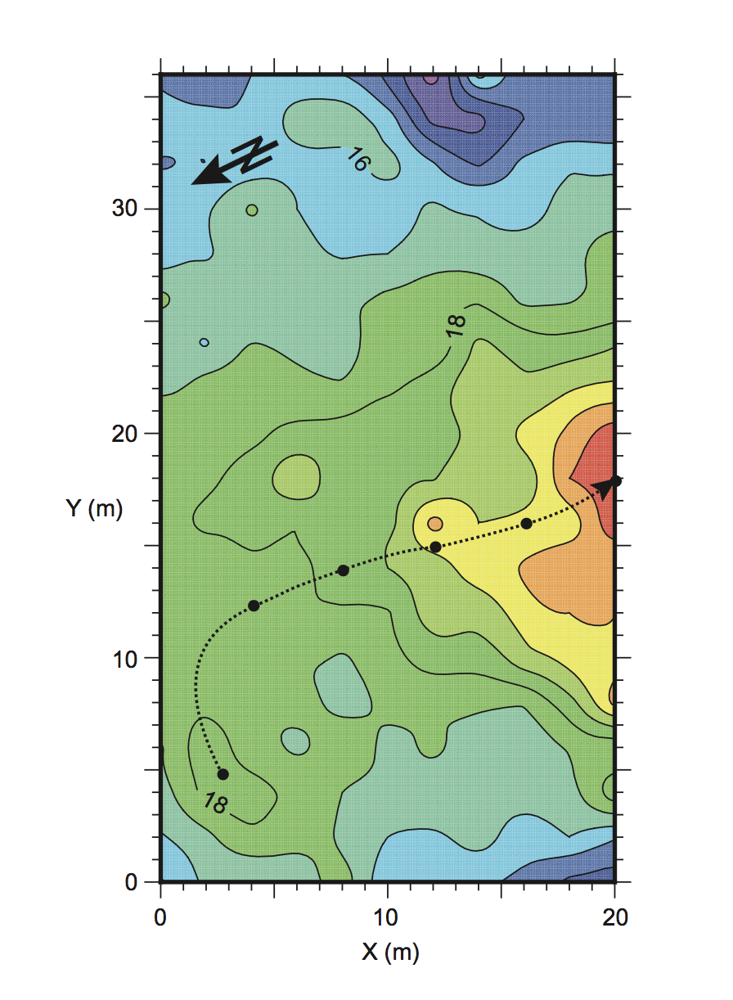

My research with the University of Idaho Computational Hydrology Group involved
using many geophysical and analytic mathmatical techniques to address complex
hydrogeolgical phenomina.

 <h2> Research Topics </h2>
<h2>Geophyisical Classification of Hot Spring Expression in Yellowstone National Park </h2>

<h2> Analytical Modeling of Heat and Fluid Flow Pathways in Hydrothermal settings </h2>

 <h2> Seismic Data Analysis </h2>

